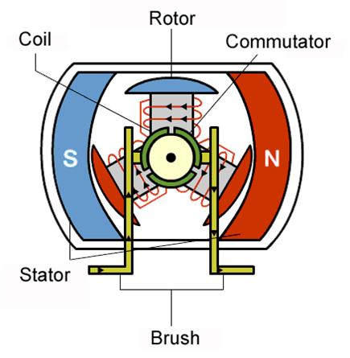
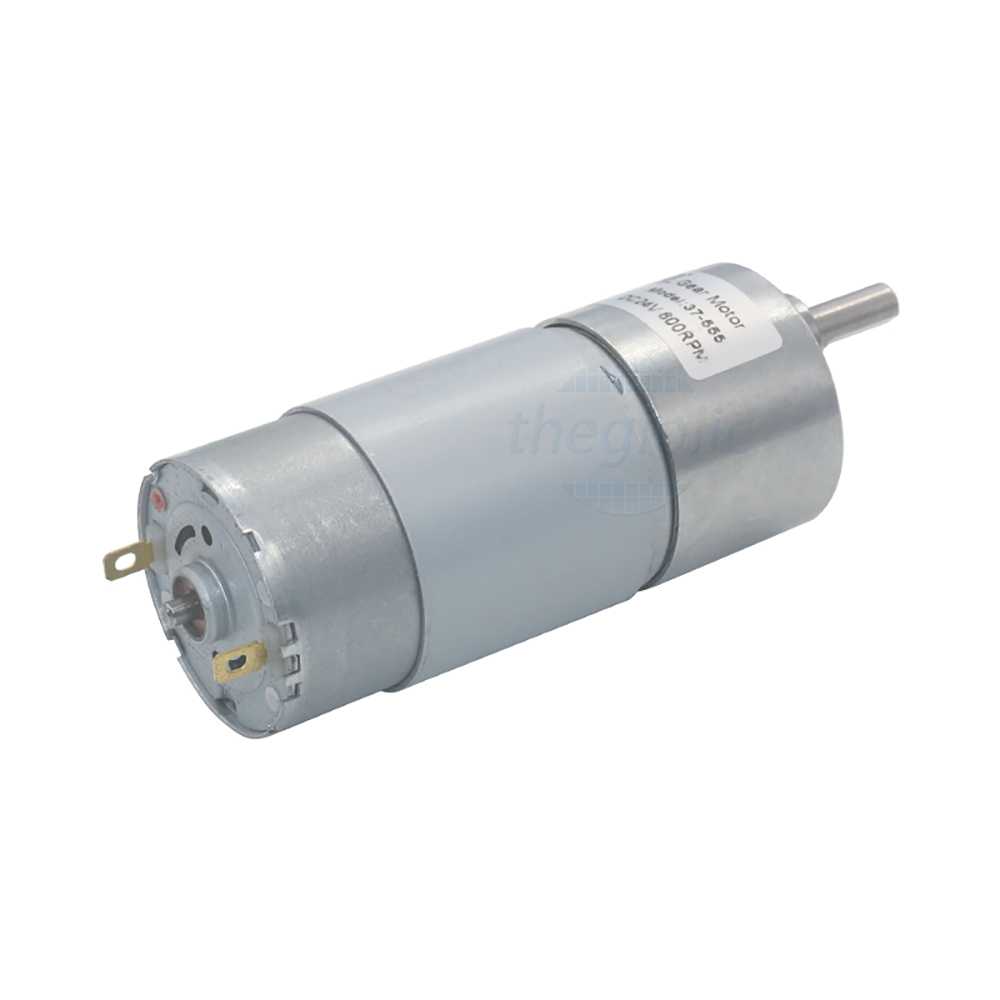
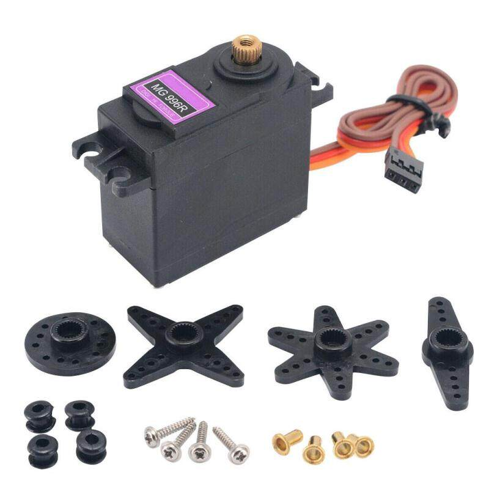

# Cơ cấu chấp hành (Actuator)

**Cơ cấu chấp hành (Actuator)** hay thiết bị truyền động là bộ phận của robot, có nhiệm vụ chuyển đổi năng lượng thành các chuyển động vật lý.

Hiểu một cách đơn giản, cơ cấu chấp hành là thành phần **tạo ra sự chuyển động** trong robot.&#x20;

Có nhiều loại cơ cấu chấp hành như cơ cấu chấp hành **thủy lực,** cơ cấu chấp hành **khí nén,** cơ cấu chấp hành **điện (động cơ)**... Hai chuyển động cơ bản cơ cấu chấp hành có thể tạo ra là **chuyển động thẳng** và **chuyển động quay.**

Trong khuôn khổ khóa học này, chúng ta sẽ được làm quen với cơ cấu chấp hành là **động cơ điện một chiều (DC motor),** tạo ra các **chuyển động quay.** Bộ kit K12 Maker cung cấp cho chúng ta 2 loại động cơ là động cơ DC và động cơ servo.

### **Động cơ DC thường (thường gọi tắt là động cơ DC)**

Động cơ điện một chiều (động cơ DC) được điều khiển bằng dòng điện một chiều. Bên trong động cơ sẽ có các phần như sau:

<figure><figcaption></figcaption></figure>

* **Rotor:** là bộ phận chính, có cấu tạo trục và được quấn các cuộn dây lại với nhau. Nhờ vậy mà sẽ tạo nên được một chiếc nam châm điện.
* **Stator:** có kết cấu giống với một chiếc nam châm vĩnh cửu, hay nam châm điện. Nhờ đó chúng sẽ hoạt động với công dụng tương đương.
* **Cổ góp (Commutator):** bộ phận này là nơi tiếp xúc và có khả năng truyền điện tới cho các cuộn dây ở trên rotor. Số điểm tiếp xúc ở trên cổ góp sẽ tương ứng với số dây được quấn ở trên bộ phận Rotor.
* **Chổi than (Brushes):** là nơi tiếp xúc và có thể tiếp điện được cho bộ phận cổ góp.

Nguyên lý hoạt động của động cơ DC đã khá quen thuộc với tất cả chúng ta khi được học qua chương trình môn Vật Lý phổ thông, vậy nên trong khóa học này, chúng ta sẽ không nhắc lại nguyên lý đó. Trong khóa học này, chúng ta sẽ quan tâm nhiều hơn tới các thức để điều khiển động cơ hoạt động theo ý muốn.

Về cơ bản, động cơ DC có 2 yếu tố cần điều khiển:

* **Tốc độ quay:** thay đổi bằng cách tăng giảm điện áp đặt vào 2 cực của động cơ.&#x20;
* **Chiều quay:** thay đổi bằng cách đảo chiều dòng điện chạy qua động cơ.&#x20;

Trong điều khiển robot, sẽ có các vi mạch điện tử (IC) chuyên dụng giúp chúng ta thực hiện việc điều khiển động cơ thông qua lập trình. Bạn sẽ cần tìm hiểu về các khái niệm **xung PWM, mạch cầu H.**

Động cơ DC có 2 thông số quan trọng nhất là **điện áp hoạt động** và **tốc độ.**

<figure><figcaption></figcaption></figure>

Trong quá trình làm robot, ngoài **tốc độ** của động cơ, bạn cũng cần quan tâm tới **gia tốc/lực kéo** của động cơ. Hai giá trị này thường tỉ lệ nghịch với nhau, tốc độ quay càng cao, lực kéo càng yếu và ngược lại. Tuy nhiên, chúng ta hoàn toàn có thể kiểm soát vấn đề này bằng cách sử dụng các giải pháp như **hộp số,** thay đổi **tỉ số truyền** của các cơ cấu truyền động như **nhông - xích, puly - dây curoa**... Chúng ta sẽ cùng tìm hiểu sâu hơn về các giải pháp này ở những phần sau.

### **Động cơ DC servo (thường gọi tắt là động cơ servo)**

Về cơ bản, cấu tạo bên trong của **động cơ DC servo** (hay động cơ servo) tương tự như động cơ DC, nhưng có thêm một mạch điện tử có chức năng nhận biết vị trí góc quay của trục động cơ, cho phép động cơ có thể được điều khiển để **quay chính xác đến một góc tùy ý** trong khoảng từ 0 đến 180 độ (khoảng này có thể khác tùy thuộc vào dòng động cơ).

Động cơ servo sẽ có 3 dây: **dây nâu** tương ứng với **chân âm (-)** của động cơ, **dây đỏ** tương ứng với **chân dương (+)** của động cơ, **dây cam** là chân tín hiệu giúp chúng ta truyền vào **tín hiệu điều khiển** để động cơ quay đến góc mong muốn.

Động cơ servo trong bộ kit K12 Maker là loại động cơ servo **MG996r**, với ưu điểm lực kéo rất khỏe. Bạn có thể tìm hiểu thêm datasheet của model động cơ này trên internet để biết thêm thông tin chi tiết.

<figure><figcaption></figcaption></figure>

Ngoài ra, bộ kit K12 Maker cung cấp thêm một loại động cơ biến thể của MG996r, tạm gọi là **động cơ servo 360 độ.** Động cơ này được thay đổi một số chi tiết bên trong khiến nó có khả năng **quay tròn** liên tục (thay vì quay đến một vị trí góc nhất định như động cơ MG996r nguyên bản).
