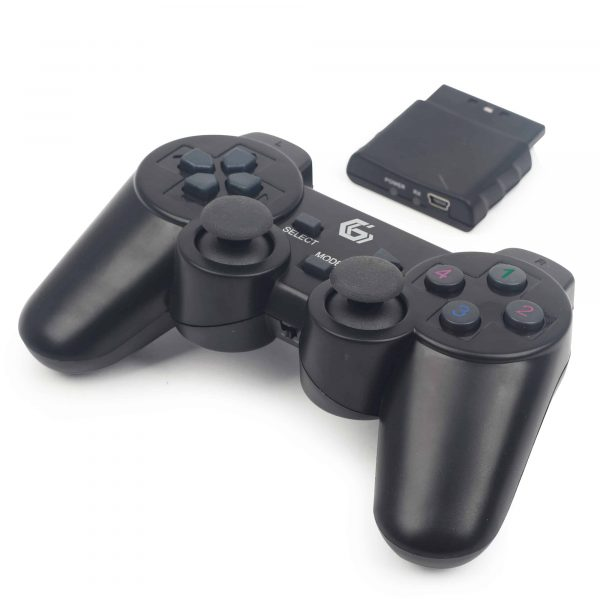

# Kit K12 Marker

Như chúng ta đã biết, robot là một sản phẩm đòi hỏi kiến thức chuyên môn ở cả 3 lĩnh vực cơ khí, điện tử và lập trình. Đó cũng là thử thách lớn nhất với các bạn trẻ mới bắt đầu học về robot.

Bộ kit K12 Maker được ra đời để giúp các bạn trẻ vượt qua thách thức đó, thông qua việc đóng gói một số công nghệ giúp các bạn trẻ rút ngắn thời gian khi chế tạo robot. Đi kèm với đó là khóa học làm robot theo phương pháp project-based learning, giúp các trẻ tiếp cận với các kiến thức về robot một cách trực quan và hứng thú hơn.

## **Các thành phần trong bộ kit K12 Maker (dành cho VRC)**:

### 1. **Bộ mạch điều khiển robot VIA B - Bánh mì.**

* **VIA B – Bánh Mì** là bo mạch phát triển phần cứng do MakerViet phát triển với mục đích phục vụ cho các dự án robotics và xe tự hành của các bạn trẻ Việt Nam. Mạch VIA B gồm module mạch điều khiển và module mạch công suất (Motor Shield) thiết kế để cắm chồng lên nhau.
* Mạch điều khiển VIA và mạch công suất VIA được thiết kế với kích thước tiêu chuẩn “Arduino-size”, giúp bạn dễ dàng kết hợp với đa dạng các bo mạch phát triển, bo mạch chức năng khác như Arduino Uno, các mạch điều khiển động cơ khác,…
* Mạch điều khiển VIA có chân kết nối với máy tính nhúng Pi, giúp bạn thực hiện được các dự án nâng cao hơn về IoT, robot hay xe tự hành.

<figure><figcaption>
<strong>Mạch điều khiển VIA</strong>
</figcaption></figure>

<mark style="color:red;">VỀ MẠCH ĐIỀU KHIỂN VIA:</mark>

* Sử dụng vi điều khiển ESP32-WROVER-E 16MB.
* Sở hữu khả năng kết nối truyền dữ liệu qua WIFI, Bluetooth, Bluetooth LE và các ưu điểm của dòng vi điều khiển ESP32 (xem datasheet để biết thêm thông tin chi tiết)
* Có header tương thích với Raspberry PI.
* Tương thích ngược với Arduino UNO shield.
* 1 cổng UART, 1 cổng I2C, 1 cổng CAN
* Cổng USB Type-C dùng để nạp code, cấp nguồn và giao tiếp Serial
* Module Gyro-Accelerometer MPU6050 tích hợp trên mạch
* Module thời gian thực RTC DS1307
* Cổng cấp nguồn DC 12V (DC5.5x2.5MM)
* Mạch được tích hợp cơ chế bảo vệ chống ngược nguồn, chập nguồn.

<figure><figcaption>
<strong>Mạch công suất VIA</strong>
</figcaption></figure>

<mark style="color:red;">**VỀ MẠCH CÔNG SUẤT VIA:**</mark>

* Sử dụng IC băm xung PCA9685, 4 IC cầu H TA6586
* 4 đầu ra động cơ DC 12v , 6 đầu ra động cơ Servo
* 1 cổng cấp nguồn DC 12V (jack KF-3.81-2 hoặc jack XT-60 tùy theo lô sản xuất)
* Các cổng giao tiếp mở rộng: 1 cổng I2C, 1 cổng SPI
* Header GPIO mở rộng: 6 chân GPIO, 2 chân cấp nguồn 5V-GND
*

    <figure><figcaption></figcaption></figure>

### 2. **Bộ gamepad RF.**

* Tay điều khiển PS2 Wireless Controller có chất lượng tốt, độ bền cao, khả năng bắt sóng lên đến 10m

<figure><figcaption>
Tay cầm PS2 và Reciver
</figcaption></figure>

* _**Lưu ý:**_ bộ nhận tín hiệu của Tay điều khiển PS2 Wireless Controller sử dụng điện áp 3.3VDC cho cấp nguồn và giao tiếp, nếu các bạn giao tiếp với các vi điều khiển 5VDC thì cần thêm 1 đế chuyển mức điện áp giao tiếp từ 5VDC sang 3.3VDC để tránh trường hợp bộ nhận tín hiệu của tay bị cháy.
* Thông số cơ bản:
  * Tay điều khiển PS2 Wireless Controller
  * Điện áp nguồn: 3.3VDC
  * Điện áp giao tiếp: 3.3VDC
  * Pin: 2xAAA
  * Khoảng cách tối đa: 10m.
* Nhược điểm:
  * Dễ bị chèn tần số, nhiều trường hợp bot điều khiển bị chèn tần số khiến loạn hoặc đứng im khi đang điều khiển.

### 3. **Pin lipo 3s 11.1V 2600mAh.**

<figure><figcaption>
Pin lipo 3s 11.1V 2600mAh.
</figcaption></figure>

* Pin Lipo ShangYi 11.1v 3s 2600mAh 45C
* Nhãn hiệu: ShangYi
* Số cell pin: 3
* Dòng: 2600mAh
* Điện áp: 11.1V
* Dòng xả: 35C
* Trọng lượng: Khoảng 210g
* Kích thước: 120x34x25mm
* Đầu cắm: EC3

Pin còn đi kèm với một vôn kế giúp đo pin.

### 4. **Các động cơ DC 555 12V 180/300/1500RPM.**

*

### 5. **Động cơ servo MG996r 180/360 độ.**

<figure><figcaption>
Servo MG996R
</figcaption></figure>

* Servo MG996R (nâng cấp MG995) có momen xoắn lớn. Đây là bản nâng cấp từ servo MG995 về tốc độ, lực kéo và độ chính xác đồng thời vừa nhanh hơn và cũng vừa nhỏ gọn hơn.
* Momen làm việc : 11kg/cm (tại điện áp 6V) , 9.4kg/cm (tại điện áp 4.8V)
* Tốc độ xoay: 0.17 giây / 60 độ (4.8 v) 0.14 giây / 60 độ (6 v)
* Điện áp làm việc: 4.8-7.2V
* Nhiệt độ hoạt động: -30 ℃ \~ 60 ℃
* Chiều dai dây: 30cm, dây nâu đỏ là 2 dây nguồn, dây vàng là dây tín hiệu
* Vật liệu bánh răng: Kim loại
* Trọng lượng: 65g

Việc điều khiển servo thường yêu cầu xung với thời gian khoảng 20ms, xung điều khiển góc trong phạm vi 0.5 – 2.5ms, với tổng thời gian là 2ms.

* 5ms -> 0 độ
* 0ms – > 45 độ
* 5ms -> 90 độ
* 0ms -> 135 độ
* 5ms -> 180 độ

### 6. **Nhôm định hình 1515.**

* Nhôm định hình 1515 nhẹ, độ cứng vừa phải, thích hợp cho các kết cấu bot đơn giản và hoạt động với tần suất trung bình.
* Khá khó tìm kiếm trên thị trường vì nhu cầu thấp trong công nghiệp.

### 7. **Các phụ kiện gá, bánh xe,...**

* Bộ phụ kiện gá bao gồm bộ gá các loại và bánh xe. Các bộ gá giúp định hình các thanh nhôm hoặc các linh kiện của robot vào đúng hướng yêu cầu của người sử dụng. Là một bộ phận quan trọng của bất cứ một sản phẩm robotics nào nhưng giá thành rẻ và vô cùng phổ biến.

