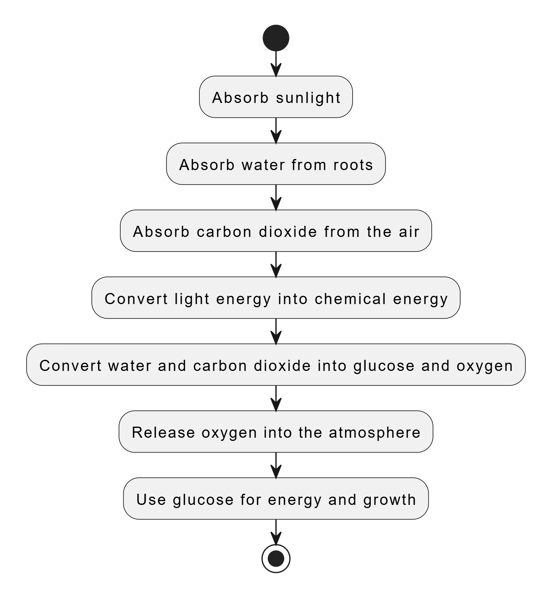

# Kit K12 Marker

Như chúng ta đã biết, robot là một sản phẩm đòi hỏi kiến thức chuyên môn ở cả 3 lĩnh vực cơ khí, điện tử và lập trình. Đó cũng là thử thách lớn nhất với các bạn trẻ mới bắt đầu học về robot.

Bộ kit K12 Maker được ra đời để giúp các bạn trẻ vượt qua thách thức đó, thông qua việc đóng gói một số công nghệ giúp các bạn trẻ rút ngắn thời gian khi chế tạo robot. Đi kèm với đó là khóa học làm robot theo phương pháp project-based learning, giúp các trẻ tiếp cận với các kiến thức về robot một cách trực quan và hứng thú hơn.

## **Các thành phần trong bộ kit K12 Maker (dành cho VRC 2023)**:

1.  **Bộ mạch điều khiển robot VIA B - Bánh mì.**

    * **VIA B – Bánh Mì** là bo mạch phát triển phần cứng do MakerViet phát triển với mục đích phục vụ cho các dự án robotics và xe tự hành của các bạn trẻ Việt Nam. Mạch VIA B gồm module mạch điều khiển và module mạch công suất (Motor Shield) thiết kế để cắm chồng lên nhau.
    * Mạch điều khiển VIA và mạch công suất VIA được thiết kế với kích thước tiêu chuẩn “Arduino-size”, giúp bạn dễ dàng kết hợp với đa dạng các bo mạch phát triển, bo mạch chức năng khác như Arduino Uno, các mạch điều khiển động cơ khác,…
    * Mạch điều khiển VIA có chân kết nối với máy tính nhúng Pi, giúp bạn thực hiện được các dự án nâng cao hơn về IoT, robot hay xe tự hành.

    <figure><figcaption>
<strong>Mạch điều khiển VIA</strong>
</figcaption></figure>

    <mark style="color:red;">VỀ MẠCH ĐIỀU KHIỂN VIA:</mark>

    * Sử dụng vi điều khiển ESP32-WROVER-E 16MB.
    * Sở hữu khả năng kết nối truyền dữ liệu qua WIFI, Bluetooth, Bluetooth LE và các ưu điểm của dòng vi điều khiển ESP32 (xem datasheet để biết thêm thông tin chi tiết)
    * Có header tương thích với Raspberry PI.
    * Tương thích ngược với Arduino UNO shield.
    * 1 cổng UART, 1 cổng I2C, 1 cổng CAN
    * Cổng USB Type-C dùng để nạp code, cấp nguồn và giao tiếp Serial
    * Module Gyro-Accelerometer MPU6050 tích hợp trên mạch
    * Module thời gian thực RTC DS1307
    * Cổng cấp nguồn DC 12V (DC5.5x2.5MM)
    * Mạch được tích hợp cơ chế bảo vệ chống ngược nguồn, chập nguồn.

    <figure><figcaption>
<strong>Mạch công suất VIA</strong>
</figcaption></figure>

    <mark style="color:red;">**VỀ MẠCH CÔNG SUẤT VIA:**</mark>

    * Sử dụng IC băm xung PCA9685, 4 IC cầu H TA6586
    * 4 đầu ra động cơ DC 12v , 6 đầu ra động cơ Servo
    * 1 cổng cấp nguồn DC 12V (jack KF-3.81-2 hoặc jack XT-60 tùy theo lô sản xuất)
    * Các cổng giao tiếp mở rộng: 1 cổng I2C, 1 cổng SPI
    * Header GPIO mở rộng: 6 chân GPIO, 2 chân cấp nguồn 5V-GND
    *

        <figure><figcaption></figcaption></figure>
2. **Bộ gamepad RF.**
   *
3. **Pin lipo 3s 11.1V 2600mAh.**
   *
4. **Các động cơ DC 555 12V 180/300/1500RPM.**
   *
5. **Động cơ servo MG996r 180/360 độ.**
   *
6. **Nhôm định hình 1515.**
   *
7. **Các phụ kiện gá, bánh xe,...**
   *

