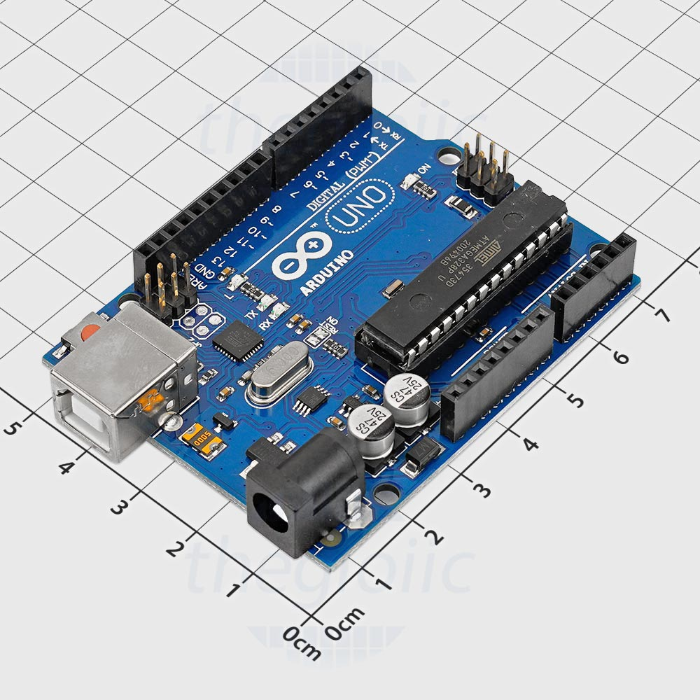
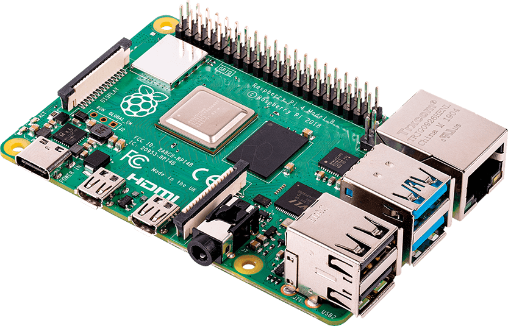

# Lập trình nhúng - IoT và quan hệ của nó với Robotics.

## Định nghĩa

Lập trình nhúng là công việc lập trình cho mạch nhúng - những mạch phổ biến với hiệu năng tốt và cực kỳ nhỏ gọn, đặc biết là có khả năng giao tiếp với các thiết bị rất tốt (thông qua GPIO, SPI, I2C,.... ).&#x20;

Ví dụ như mạch Arduino Uno R3, sử dụng ATmega328 - là mạch nhúng cực kỳ phổ biến trên toàn thế giới bởi giá thành rẻ so với công năng của nó đặc biết là đối với ngành giáo dục.&#x20;

<figure><figcaption>
Arduino Uno R3 - nguồn tại thegioiic.com
</figcaption></figure>

Ngoài ra còn có mạch Raspberry Pi, một mạch mà ở thời điểm ra mắt đã được chú tâm rất nhiều bởi hiệu năng và công năng của nó - Raspberry Pi sử dụng SoC với đủ hiệu năng để có thể chạy một hệ điều hành bên trong nó. Có rất nhiều project sử dụng Raspberry Pi như là một máy chủ NAS (máy chủ lưu trữ dữ liệu đám mây), Web Server, DNS Server,... bởi nó có thể cài đặt cả hệ điều hành Linux - hệ điều hành rất phổ biến để sử dụng trong datacenter. Ngược điểm của nó chỉ có duy nhất là giá thành cao hơn so với Arduino, khiến nó khó tiếp cận hơn.

<figure><figcaption>
Raspberry Pi 4 Model B - nguồn tại raspberrypi.com
</figcaption></figure>

## Công dụng của hệ thống nhúng - Định nghĩa IoT (Internet of Things)

Thuật ngữ IoT (Internet vạn vật) đề cập đến mạng lưới tập hợp các thiết bị thông minh và công nghệ tạo điều kiện thuận lợi cho hoạt động giao tiếp giữa thiết bị và đám mây cũng như giữa các thiết bị với nhau.&#x20;

Nhờ sự ra đời của chip máy tính giá rẻ và công nghệ viễn thông băng thông cao, ngày nay, chúng ta có hàng tỷ thiết bị được kết nối với Internet. Điều này nghĩa là các thiết bị hàng ngày như bàn chải đánh răng, máy hút bụi, ô tô và máy móc có thể sử dụng cảm biến để thu thập dữ liệu và phản hồi lại người dùng một cách thông minh.

IoT mang lại nhất nhiều công dụng đến với đời sống con người và sản xuất, chúng giúp nâng cao chất lượng cuộc sống của con người chúng ta, ví dụ như các thiết bị thông minh có thể thay đổi hoàn toàn thói quen buổi sáng của bạn. Khi bạn nhấn nút tạm hoãn, chiếc đồng hồ báo thức của bạn sẽ tự động bật máy pha cà phê và kéo mở rèm cửa sổ. Tủ lạnh của bạn sẽ tự động phát hiện những thực phẩm sắp hết và đặt mua giao tận nhà. Lò nướng thông minh sẽ cho bạn biết thực đơn trong ngày và thậm chí còn nấu những nguyên liệu đã được chuẩn bị sẵn để đảm bảo rằng bữa trưa của bạn đã sẵn sàng. Chiếc đồng hồ thông minh sẽ lên lịch họp cho bạn, trong khi đó, chiếc ô tô thông minh của bạn tự động đặt vị trí GPS dừng xe để nạp nhiên liệu. Tiềm năng là vô hạn trong thế giới IoT!

## Đối với Robotics

Như được đề cập ở [#cac-thanh-phan-cua-robot](../../robot-la-gi.md#cac-thanh-phan-cua-robot "mention"), mạch nhúng sẽ đóng vai trò là đơn vị điều khiển các cơ cấu chấp hành thông qua việc nhận đầu vào (Qua điều khiển, dựa vào cảm biến,....).&#x20;

