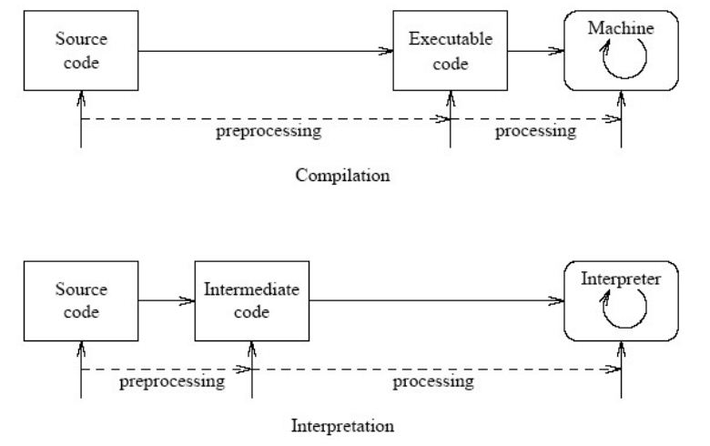

# Ngôn ngữ lập trình bậc cao và bậc thấp.

## Ngôn ngữ lập trình bậc cao và ngôn ngữ lập trình bậc thấp

Trước hết đây là bảng so sánh giữa ngôn ngữ lập trình bậc cao với ngôn ngữ lập trình bậc thấp:

<table><thead><tr><th width="273">Bậc Cao</th><th>Bậc Thấp</th><th>Tính năng</th></tr></thead><tbody><tr><td>Cao</td><td>Thấp</td><td>Độ "trừu tượng"</td></tr><tr><td>Cao</td><td>Thấp</td><td>Tính di động</td></tr><tr><td>Dễ hơn</td><td>Khó hơn</td><td>Độ khó</td></tr><tr><td>Kém hơn</td><td>Tốt hơn</td><td>Độ hiệu quả</td></tr><tr><td>Python, Java, JavaScript</td><td>C, C++, Assembly</td><td>Ví dụ</td></tr></tbody></table>

Đây là ví dụ về một chương trình bậc cao sử dụng Python:&#x20;

```python
def factorial(n):
    if n == 0:
        return 1
    else:
        return n * factorial(n - 1)

int nIn = input()
print(factorial(nIn))
```

Hàm trên có tác dụng là tính giai thừa của số được nhập vào. Có thể thấy rằng kể cả bạn chưa có kiến thức về lập trình từ trước thì bạn cũng có thể dễ dàng hiểu tác dụng của chương trình này.

Và đây là ví dụ về chương trình bậc thấp sử dụng C:

```c
int factorial(int n) {
    if (n == 0) {
        return 1;
    } else {
        return n * factorial(n - 1);
    }
}

int main() {
    int n;
    printf("Enter a number: ");
    scanf("%d", &n);

    printf("The factorial of %d is %d\n", n, factorial(n));

    return 0;
}
```

Chương trình trên có tác dụng giống với chương trình Python được đề cập ở trước đó, có thể thấy rằng đoạn chương trình trên không những dài hơn mà nó sẽ khó đọc và hiểu hơn, một phần là do cấu trúc của chương trình nó gần giống với ngôn ngữ máy hơn.

## Thông dịch và biên dịch

Nhưng khi nói đến hiệu năng, thì chúng lại có sự khác biệt rõ ràng, trước đó chúng ta hãy tìm hiểu về ngôn ngữ sử dụng trình biên dịch và thông dịch: (nguồn từ tuhoclaptrinh.edu.vn)

| Thông dịch                                                                       | Biên dịch                                                                                         |
| -------------------------------------------------------------------------------- | ------------------------------------------------------------------------------------------------- |
| Dịch từng câu lệnh trong chương trình ngay tại thời điểm thực hiện.              | Quét toàn bộ chương trình trong một lần.                                                          |
| Yêu cầu mã nguồn cho việc thực thi sau này.                                      | Không yêu cầu mã nguồn thực thi sau này.                                                          |
| Mất ít thời gian phân tích mã nguồn, nhưng thời gian thực thi tổng thể khá chậm. | Mất nhiều thời gian để phân tích mã nguồn, nhưng thời gian thực thi tổng thể vô cùng nhanh chóng. |
| Dừng thông dịch nếu phát hiện ra lỗi.                                            | Khởi tạo báo cáo lỗi sau khi chuyển đổi toàn bộ mã lệnh.                                          |
| Lưu trữ ngôn ngữ máy dưới dạng mã máy trên đĩa.                                  | Không lưu trữ                                                                                     |

### Cách chương trình được tạo ra

Cách ngôn ngữ lập trình bậc cao sử dụng trình thông dịch hoạt động khác với ngôn ngữ lập trình bậc thấp sử dụng trình biên dịch, về bản chất nó bao gồm 3 giai đoạn:&#x20;

<figure><figcaption><p>Quá trình tạo ra một chương trình</p></figcaption></figure>

Chúng đều giống nhau ở việc điểm đầu và điểm cuối luôn là từ mã nguồn (Source Code, chính là code mà chúng ta viết ban đầu), và điểm cuối sẽ luôn là dạng mã máy để máy có thể thực thi.

### Bậc cao và bậc thấp ? Nên chọn cái nào ?

#### Cách hai loại chương trình khởi chạy

Điểm khác nhau của chúng chính là quá trình chuyển đổi của nó, ở ngôn ngữ lập trình bậc thấp, để chương trình có thể thực thi, bạn buộc phải đưa nó qua một trình biên dịch - thứ mà sẽ dùng mã nguồn của bạn để chuyển nó sang dạng mã máy mà máy bạn có thể thực thi. Bạn sẽ nhận ra rằng ban đầu từ mã nguồn Main.c mà trình biên dịch đã tạo ra một chương trình có đuôi .exe (ở trên Windows) và bạn chỉ cần thực thi và nó chạy ngay lập tức. Trong chương trình có đuôi .exe đó chứa mã máy, thứ mà máy bạn có thể hiểu và thực thi ngay lập tức.

Đối với ngôn ngữ lập trình bậc cao, bạn không cần làm thêm bất cứ điều gì để có thể chạy chương trình đó, ngoài việc bạn phải cài sẵn một phần mềm có tác dụng thông dịch như Python đối với Python, JRE (Java Runtime Environment) đối với Java. Ngay tại đây bạn đã thấy có chút khác biệt là để có thể chạy chương trình đó thì ngay tại máy mà bạn muốn cho chương trình chạy sẽ phải cài chương trình có tác dụng thông dịch. Nhưng khi đó, việc của bạn cần làm là cho chúng chương trình của bạn, và nó hoạt động mà không cần phải qua trình biên dịch, đưa ra một file .exe rồi bạn phải khởi động nó. Việc mà trình thông dịch làm đó chính là nó sẽ dịch và chạy ngay tức khắc đoạn mã mà nó dịch đến, để dễ hình dung thì bạn hiểu là bạn đưa cho nó mã nguồn, nó dịch được ra mã máy đến đâu thì nó chạy đến đó vậy. Chương trình đó có thể là ở dạng mã nguồn (source code) hoặc là dạng bytecode (dạng mã mà không phụ thuộc vào nền tảng). Xem thêm về [Bytecode](https://en.wikipedia.org/wiki/Bytecode).

#### Ưu điểm của từng loại

Đây là khi điểm mạnh của ngôn ngữ lập trình bậc cao được phát huy về tính di động, vì chỉ cần với một file .py, bạn có thể đưa ra nhiều hệ điều hành khác nhau như macOS, Windows hay Linux với chỉ với mã nguồn của bạn, khác với ngôn ngữ bậc thấp khi bạn phải thông dịch nó cho từng nền tảng khác nhau trước khi có thể phân phối chúng như .exe cho Windows, binary cho macOS và Linux (chương trình mã nhị phân trên nền tảng dựa vào UNIX không có đuôi tệp). \
Nhưng việc phải dịch mã khi khởi chạy lại trở thành điểm yếu của ngôn ngữ lập trình bậc cao vì lúc này bản thân hệ thống phải chạy thêm công đoạn là thông dịch ra mã máy, khác với mã nhị phân có đuôi .exe trên Windows khi hệ thống chỉ việc thực thi ngay mã nhị phân. Và điều này ảnh hưởng xấu đến hiệu năng của chương trình. Thứ bạn thấy rõ ràng nhất là khi lập trình game nặng yêu cầu hệ thống cao, chẳng ai sử dụng ngôn ngữ lập trình bậc cao sử dụng trình thông dịch như Java hay Python mà họ thường sử dụng ngôn ngữ phổ biến như C# (bậc trung) hay C/C++ (bậc thấp).
